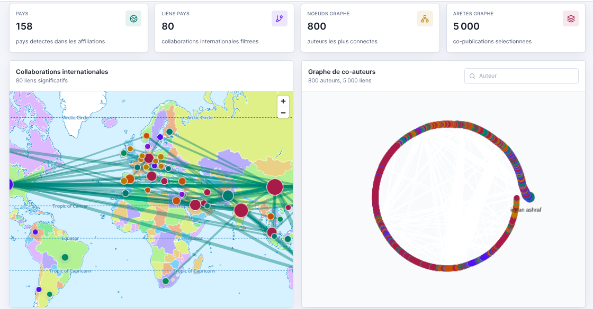

<div align="center">

# Observatoire IEEE IA

Dashboard interactif de fouille de donnees scientifiques autour des articles IEEE lies a l'intelligence artificielle, au machine learning, au deep learning, au NLP et aux LLM.

[](https://ai-articles-ieee.netlify.app/)


**Demo live :** https://ai-articles-ieee.netlify.app/

</div>



## Sommaire

- [Vue d'ensemble](#vue-densemble)
- [Objectifs](#objectifs)
- [Resultats cles](#resultats-cles)
- [Fonctionnalites](#fonctionnalites)
- [Architecture du pipeline](#architecture-du-pipeline)
- [Structure du depot](#structure-du-depot)
- [Stack technique](#stack-technique)
- [Installation locale](#installation-locale)
- [Workflow data](#workflow-data)
- [Application web](#application-web)
- [Deploiement Netlify](#deploiement-netlify)
- [Donnees et artefacts](#donnees-et-artefacts)
- [Limites](#limites)
- [Licence](#licence)

## Vue d'ensemble

Ce projet transforme un corpus brut d'exports IEEE en une application web statique permettant d'explorer les tendances, themes, auteurs, laboratoires, pays, clusters et collaborations scientifiques autour de l'IA.

Le travail couvre toute la chaine :

- import des fichiers JSON IEEE vers SQLite ;
- fusion et harmonisation des bases ;
- controle qualite et analyses exploratoires ;
- extraction de features textuelles ;
- clustering d'articles et d'auteurs ;
- analyse de graphes de collaboration ;
- export de donnees JSON pour le frontend ;
- restitution dans un dashboard React deploye sur Netlify.

## Objectifs

Le projet vise a rendre exploitable un corpus scientifique volumineux en repondant a plusieurs questions :

- comment evoluent les publications IEEE liees a l'IA dans le temps ?
- quels themes, mots-cles et sources dominent le corpus ?
- quels auteurs, laboratoires et pays sont les plus representes ?
- quelles collaborations apparaissent entre auteurs et entre pays ?
- quels regroupements thematiques emergent via le clustering ?
- quelles limites de qualite ou de couverture doivent etre prises en compte ?

## Resultats cles

La base fusionnee principale est `bd/fusion_ieee.db`.

| Indicateur | Volume |
| --- | ---: |
| Articles | 10 077 |
| Auteurs | 53 493 |
| Laboratoires / affiliations | 30 146 |
| Mots-cles | 159 043 |
| Relations article-auteur | 57 162 |
| Relations auteur-laboratoire | 60 214 |

Ces donnees sont consolidees puis exportees dans `site/public/data/*.json` pour alimenter l'application web sans backend.

## Fonctionnalites

### Pipeline Python

- Import de plusieurs corpus IEEE thematiques.
- Creation de bases SQLite intermediaires.
- Fusion relationnelle des articles, auteurs, laboratoires et mots-cles.
- Remapping des IDs pour conserver les relations correctes apres fusion.
- Nettoyage et diagnostic de la base fusionnee.
- Generation de statistiques descriptives.
- Extraction TF-IDF et creation de features.
- Clustering d'articles et d'auteurs.
- Preparation des donnees de prediction.
- Construction de graphes de co-auteurs.
- Calcul de centralites et detection de communautes.
- Export des donnees publiques au format JSON.

### Dashboard web

- Synthese globale du corpus.
- Courbes temporelles de publications.
- Repartition par source IEEE.
- Exploration des mots-cles dominants.
- Table interactive des articles.
- Profils d'auteurs, laboratoires et pays.
- Carte et graphe des collaborations.
- Vue des clusters thematiques.
- Page methodologie et limites d'interpretation.

## Architecture du pipeline

```text
bdSource/*.json
    -> scripts_imports/
    -> bd/*.db
    -> scripts_fusions/
    -> bd/fusion_ieee.db
    -> analyse/
       -> EDA
       -> clustering
       -> prediction
       -> collaboration
    -> scripts_exports/export_site_data.py
    -> site/public/data/*.json
    -> site/ React + Vite
    -> Netlify
```

Le site ne lit pas SQLite directement. Il consomme uniquement des fichiers JSON statiques generes localement, ce qui rend le deploiement simple, rapide et sans serveur.

## Structure du depot

```text
docs/                Documents de reference
notebooks/           Notebooks d'exploration
bdSource/             Fichiers JSON IEEE sources
bd/                   Bases SQLite locales generees
scripts_imports/      Import JSON vers SQLite
scripts_fusions/      Fusion et nettoyage des bases
scripts_exports/      Export des donnees du site
inspectBdFusionnee/   Scripts de diagnostic de la base fusionnee
analyse/
  EDA/                Analyses exploratoires
  clustering/         TF-IDF, KMeans, preparation prediction
  prediction/         Pretraitement, entrainement, prediction
  collaboration/      Graphes de co-auteurs et communautes
outputs/              Sorties generees non versionnees
site/                 Application web Vite + React + TypeScript
```

## Stack technique

### Data

- Python 3.11
- SQLite
- Pandas
- NumPy
- SciPy
- Scikit-learn
- Joblib
- NetworkX
- Python-Louvain
- Matplotlib
- Seaborn
- WordCloud
- Folium
- PyVis

### Frontend

- React 18
- TypeScript
- Vite
- Tailwind CSS
- Apache ECharts
- MapLibre GL JS
- Sigma.js
- Graphology
- TanStack Table
- Lucide React

### Deploiement

- Netlify
- Build statique Vite
- Donnees JSON versionnees dans `site/public/data/`

## Installation locale

Depuis la racine du projet :

```bash
python3 -m venv .venv
source .venv/bin/activate
python -m pip install --upgrade pip
python -m pip install -r requirements.txt
```

Verifier rapidement l'environnement Python :

```bash
python -c "import pandas, sklearn, networkx, folium; print('env ok')"
```

## Workflow data

Les commandes suivantes se lancent depuis la racine du depot.

### 1. Importer les exports IEEE

Chaque script recree sa base cible dans `bd/`.

```bash
python scripts_imports/import_AI.py
python scripts_imports/import_DL.py
python scripts_imports/import_ML.py
python scripts_imports/import_NLP.py
python scripts_imports/import_ieee_to_sqlite.py
```

### 2. Fusionner et nettoyer

```bash
python scripts_fusions/fusion_bases_v2.py
python scripts_fusions/nettoyage_fusion.py
```

`fusion_bases_v2.py` remappe les IDs des articles, auteurs et laboratoires depuis les bases sources vers la base fusionnee. Cela evite les liens incorrects dans `article_authors` et `author_labs` apres dedoublonnage.

### 3. Inspecter la base

```bash
python liste_bd.py
python inspectBdFusionnee/descriptionBD.py
python inspectBdFusionnee/analyse_fusion.py
```

### 4. Lancer les analyses exploratoires

```bash
python analyse/EDA/01_Chargement_et_inspection.py
python analyse/EDA/02_Verification_integrite_relationnelle.py
python analyse/EDA/03_Statistiques_descriptives.py
python analyse/EDA/04_Analyse_mots_cles.py
python analyse/EDA/05_Analyse_auteurs_labs.py
python analyse/EDA/06_Qualite_des_donnees.py
```

### 5. Generer les clusters

```bash
python analyse/clustering/01_Extraction_mots_cles_articles.py
python analyse/clustering/02_TFIDF_et_features.py
python analyse/clustering/03_Clustering_articles.py
python analyse/clustering/04_Clustering_auteurs.py
python analyse/clustering/05_Preparation_features_prediction.py
```

Sorties principales :

- `analyse/clustering/features.pkl`
- `analyse/clustering/features_auteurs.pkl`
- `analyse/clustering/clusters_articles.csv`
- `analyse/clustering/clusters_auteurs.csv`
- `analyse/prediction/features_prediction.csv`

### 6. Entrainer et utiliser la prediction

```bash
python analyse/prediction/01_Preprocess.py
python analyse/prediction/02_Training.py
python analyse/prediction/03_Predict.py
```

Le preprocessing sauvegarde notamment :

- `tfidf_transformer.pkl`
- `ohe_country.pkl`
- `feature_config.pkl`

### 7. Analyser les collaborations

```bash
python analyse/collaboration/01_Construction_graphe.py
python analyse/collaboration/02_Mesures_centralite.py
python analyse/collaboration/03_Detection_communautes.py
python analyse/collaboration/04_Visualisation_communautes.py
```

Une visualisation HTML interactive peut aussi etre generee :

```bash
python analyse/collaboration/graph_html.py
```

Les sorties visuelles et fichiers lourds sont places dans `outputs/`.

## Application web

Les donnees publiques du site sont exportees depuis `bd/fusion_ieee.db` vers `site/public/data/`.

Depuis la racine :

```bash
python scripts_exports/export_site_data.py
```

Puis lancer le site localement :

```bash
cd site
npm install
npm run dev
```

URL locale par defaut :

```text
http://127.0.0.1:5173/
```

Verifier le build de production :

```bash
cd site && npm run build
```

## Deploiement Netlify

Le projet est configure pour Netlify avec le fichier `netlify.toml` situe a la racine.

```toml
[build]
  base = "site"
  command = "npm run build"
  publish = "dist"

[build.environment]
  NODE_VERSION = "22"
```

Parametres Netlify attendus :

| Parametre | Valeur |
| --- | --- |
| Base directory | `site` |
| Build command | `npm run build` |
| Publish directory | `dist` |
| Node.js | `22` |

Le guide de publication est detaille dans [DEPLOYMENT.md](DEPLOYMENT.md).

## Donnees et artefacts

Les fichiers suivants restent locaux et ne doivent pas etre versionnes :

- `bd/*.db`
- `analyse/**/*.pkl`
- `analyse/**/*.npz`
- `outputs/`
- `site/node_modules/`
- `site/dist/`
- `.venv/`

Les fichiers JSON dans `site/public/data/` sont volontairement versionnes afin que Netlify puisse construire et publier le site sans executer le pipeline Python.

## Limites

- Le corpus depend des exports IEEE disponibles dans `bdSource/`.
- Les pays sont deduits des affiliations et peuvent rester ambigus pour certains laboratoires.
- Les clusters sont exploratoires et ne remplacent pas une annotation scientifique manuelle.
- Le graphe public est filtre pour conserver une navigation fluide.
- Les tendances refletent ce corpus IEEE, pas l'ensemble de la litterature scientifique mondiale.

## Licence

Projet distribue sous licence MIT. Voir [LICENSE](LICENSE).
